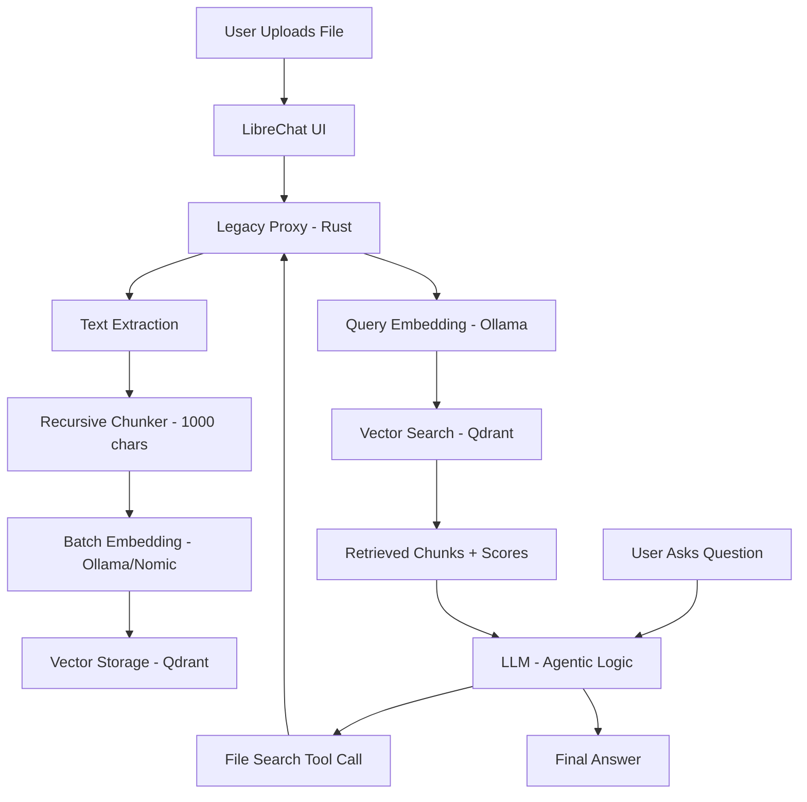

# RAG Implementation Report: Local Semantic Intelligence

## 1. LibreChat RAG Architecture: The Dual Path

Our implementation bridges the gap between legacy ingestion protocols and modern agentic retrieval.

### A. The "File Search" Tool (Modern/Agentic)
*   **How it works**: The LLM (e.g., Kimi) acts as an orchestrator. It uses the `File Search` tool by rephrasing user intent into a search query.
*   **Our Role**: The `legacy-proxy` intercepts these tool calls at `/query`. We turn the query into a vector via Ollama, perform a similarity search in Qdrant, and return the top 4 most relevant chunks.
*   **Benefit**: High precision, as the model can iteratively search until it finds what it needs.

### B. The "Retrieval" Flow (Legacy Ingestion)
*   **How it works**: Files uploaded through the UI are sent to `POST /embed`. 
*   **Our Role**: We replaced the default Python/Langchain stack with a lightweight Rust runtime (`app-runtime`). It handles UTF-8 safe chunking and stable batch ingestion into Qdrant.

---

## 2. System Flow Diagram

---

## 3. Current Limitations & Performance Benchmarks

### The "18-Minute Novel" Analysis
*   **Metric**: 1MB Text File (~1,000 chunks) = ~18 minutes ingestion.
*   **The Cause**: **Compute Saturation**. On a standard CPU, Ollama requires ~1 second to generate a 768-dimension vector for a 1,000-character chunk.
*   **Stability over Speed**: We prioritized sequential batching (20 chunks/req) to prevent Ollama from dropping connections, which was observed during parallel testing.

### Optimization Roadmap:
*   **GPU Acceleration**: Switching to a GPU-enabled Ollama instance would reduce this time to **under 60 seconds**.
*   **Vector Quantization**: Reducing vector precision (e.g., to binary or int8) in Qdrant to speed up lookups for massive libraries.

---

## 4. Next Steps for Exploration

### 📄 Broadening Document Support
*   **PDF Ingestion**: Integrate a Rust-based PDF extractor (`pdf-extract`) to handle academic papers and technical manuals.
*   **Vision-RAG**: Use models like `Llava` to describe diagrams/images within documents, making the "visual knowledge" searchable.

### 🧠 Model Diversification
*   **Cloud Hybrid**: Implement an optional "Fast Path" using OpenAI's `text-embedding-3-small`. This would allow sub-10 second ingestion for large files for users willing to use a cloud API.
*   **Large-Context Local**: Experiment with `mxbai-embed-large` for more nuanced retrieval in complex legal or medical documents.

### 🔍 Advanced Retrieval Techniques
*   **Hybrid Search**: Combine semantic (Vector) search with full-text (Keyword) search to find specific technical terms or IDs that are difficult to "match" semantically.
*   **Re-ranking**: Implement a "Cross-Encoder" pass to re-rank the top results, ensuring only the highest-quality snippets reach the model.
